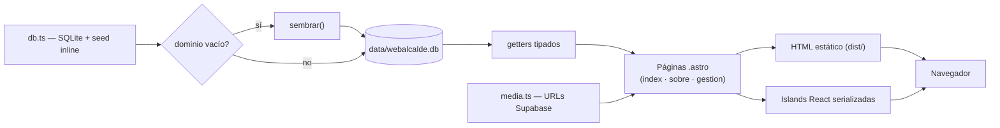

# Refactor WebAlcalde — informe técnico

**Rama:** `matias-backup-antes-de-merge`
**Proyecto:** WebAlcalde — "Cocha, la mejor ciudad de Bolivia" (Astro SSG)
**Fecha:** 2026-09

> Documento que resume y detalla el refactor completo: qué estaba mal, qué se hizo,
> cómo quedó la arquitectura, qué se mejoró, qué se sacrificó a propósito y qué queda
> pendiente. Sirve de mapa para cualquiera que toque este repo.

---

## Contenido

1. [Resumen ejecutivo](#1-resumen-ejecutivo)
2. [Estado previo — por qué se refactorizó](#2-estado-previo)
3. [Estado final — mapa de archivos](#3-estado-final--mapa-de-archivos)
4. [Capa de datos — SQLite en detalle](#4-capa-de-datos)
5. [Capa de media — Supabase](#5-capa-de-media)
6. [Páginas autocontenidas](#6-páginas-autocontenidas)
7. [Flujo de datos (build y runtime)](#7-flujo-de-datos)
8. [Colores centralizados](#8-colores-centralizados)
9. [Robustez y bugs corregidos](#9-robustez-y-bugs-corregidos)
10. [Decisiones y trade-offs](#10-decisiones-y-trade-offs)
11. [Verificación](#11-verificación)
12. [Deuda técnica](#12-deuda-técnica)
13. [Cómo trabajar el repo](#13-cómo-trabajar-el-repo)

---

## 1. Resumen ejecutivo

El proyecto empezó con **varios orígenes de verdad dispersos** y capas intermedias que
no aportaban valor. Después del refactor:

- El **contenido editorial vive en SQLite** (`data/webalcalde.db`), sembrada desde un
  seed **incrustado en `src/lib/db.ts`** — la carpeta `src/constants/` ya no existe.
- Las **imágenes y videos siguen en Supabase**, resueltas por una única capa
  (`src/lib/media.ts`).
- Las **3 páginas son autocontenidas**: cada sección vive dentro de su página.
  Se eliminaron ~11 componentes `.astro` que solo añadían niveles.
- Los **islands React** se mantienen como componentes, pero reciben los datos **por
  props** (no importan la base de datos).
- Se centralizó el **color de marca** en tokens CSS y se arreglaron puntos frágiles
  (build intermitente por `inferSize`, acento hardcodeado del libro 3D).

Resultado: `npm run build` compila 3 páginas sin errores en `dist/`.

| Dato rápido | Valor |
|---|---|
| Framework | Astro 7 · SSG estático |
| Páginas | `/`, `/sobre`, `/gestion` |
| Contenido | SQLite `node:sqlite` + seed inline en `src/lib/db.ts` |
| Media | Supabase (bucket público) vía `src/lib/media.ts` |
| Interactividad | React 19 islands (`client:*`) |
| Requisito | Node ≥ 22.12 |

---

## 2. Estado previo

### 2.1 Múltiples fuentes de verdad para el contenido

| Fuente (antes) | Rol |
|---|---|
| `src/constants/temario.ts` | Capítulos + eras + obras del libro |
| `src/constants/gestion.ts` | Hero de gestión, pilares, proyectos |
| `src/constants/historia.ts` | Línea de tiempo de hitos |
| `src/constants/media.ts` | URLs de imágenes/videos en Supabase |

El contenido se leía de archivos TS y, en paralelo, existía una base SQLite (WIP):
**la verdad vivía en dos lugares** y podían divergir.

### 2.2 Secciones a medio camino

Sections importantes (hero, video, antes/después, libro, biografía, tarjetas, línea
de tiempo, hero de gestión, eras, obras, proyectos) estaban repartidas en componentes
`.astro` intermedios que solo empaquetaban markup. Para entender una página había que
saltar entre 4-5 archivos.

### 2.3 Puntos frágiles

1. **Build intermitente**: `Image` con `inferSize` sobre fotos remotas de Supabase →
   "failed to fetch remote image dimensions" (Astro descarga la imagen en build-time).
2. **Color de marca hardcodeado** en ~40 lugares (`bg-[#472d82]`, hex en CSS modules,
   canvas de ThreeBook…).
3. **Libro 3D** pintaba texturas con `accent = '#472d82'` fijo.
4. **`HeroCard.tsx`**: prop `foco` mal nombrada (`_foco`) que se descartaba
   silenciosamente → el encuadre no funcionaba.
5. **Constante muerta** `TODAS_LAS_SECCIONES` (nunca importada).
6. **`playground.astro`** + `DevTools/ImagePlayground.tsx`: herramienta de dev
   expuesta como página pública del sitio.

```text
ESTRUCTURA ANTES (muchos archivos intermedios + constants + playground)
src/
├── components/
│   ├── Gestión/{HeroGestion, Era, SeccionObras, Proyectos}.astro   ← 4 intermedios
│   ├── Hero/{Hero, HeroCard, GaleriaModal}.astro|.tsx
│   ├── Home/{VideoBiografia, AntesDespues, Biografia, Tarjetas, IntroLibro}.astro  ← 5 intermedios
│   ├── Historia/{LineaTiempo, TimelineGaleria}.astro|.tsx
│   ├── DevTools/ImagePlayground.tsx                                 ← dev como página
│   └── (FlipBook, Book, ImageSlider, ValueCards, Header, Preloader)
├── constants/{temario, gestion, historia, media}.ts                 ← doble fuente de verdad
├── pages/{index, sobre, gestion, playground}.astro                  ← playground público
└── lib/{db, ajusteImagen}.ts
```

---

## 3. Estado final — mapa de archivos

Estructura real del repo después del refactor (verificada con el filesystem):

```text
ESTRUCTURA DESPUÉS (3 páginas autocontenidas, sin constants, sin playground)
src/
├── components/                  ← solo islands (client) y lo compartido
│   ├── Book/Book.tsx                         ← páginas del libro (recibe props)
│   ├── FlipBook/{FlipBook,ThreeBook,Cover3D} ← flip + tapa 3D (three.js)
│   ├── Header/Header.astro + HeaderMovil.tsx ← nav + menú móvil
│   ├── Hero/{HeroCard, GaleriaModal}.tsx     ← carrusel + modal de fotos
│   ├── Historia/TimelineGaleria.tsx          ← galería de la línea de tiempo
│   ├── Home/ComparadorAntesDespues.tsx       ← slider antes/después
│   ├── ImageSlider/*                         ← carrusel interior del libro
│   ├── Preloader/Preloader.astro             ← loading inicial
│   └── ValueCards/ValueCards.tsx             ← bio / misión / visión
├── layouts/Layout.astro         ← <html> + Preloader + Header + <main> + global.css
├── lib/                         ← LA capa de datos (antes constants/)
│   ├── db.ts                    ← SQLite + seed inline + tipos + getters
│   ├── media.ts                 ← URLs de Supabase (antes constants/media.ts)
│   └── ajusteImagen.ts          ← encuadre/zoom de la imagen
├── pages/                       ← SOLO 3 páginas, cada una autocontenida
│   ├── index.astro              ← /
│   ├── sobre.astro              ← /sobre (trae su <style> y <script> inline)
│   └── gestion.astro            ← /gestion (trae su <style> inline)
├── styles/
│   ├── global.css               ← tokens de color (@theme) + import Tailwind
│   ├── header.css
│   └── sobre.css                ← máquinas de escribir del hero
└── types/
    ├── nav.ts
    └── node-env.d.ts            ← declara node:sqlite / node:fs / node:path
```

---

## 4. Capa de datos

### 4.1 `src/lib/db.ts`

Un solo archivo concentra: tipos, seed y acceso a datos.

- **Motor:** `node:sqlite` (`DatabaseSync`), módulo nativo de Node ≥ 22.12 — sin
  dependencias ni binarios.
- **Persistencia:** `data/webalcalde.db` (en `.gitignore`; se genera sola al compilar).
- **Esquema documental:** una sola tabla `contenido(dominio, clave, orden, data-json)`.
  Cada dominio es un ámbito y cada fila guarda un JSON. Agregar contenido nuevo no
  pide migraciones.
- **Seed inline:** ya no existe `src/constants/`. Todo el contenido editorial se
  define como constantes en este mismo archivo y `sembrar()` puebla la DB si algún
  dominio está vacío. De ahí en adelante la fuente de verdad es la base (se puede
  editar la `.db` sin tocar código).
- **Getters tipados:** la API pública que las páginas consumen es:

| Getter | Devuelve |
|---|---|
| `getCapitulos()` | 3 capítulos de apertura |
| `getEras()` | 2 eras con sus 13 secciones y obras |
| `getGestionHero()` | hero de gestión (`kicker`, `titulo`, `bajada`, `periodo`) |
| `getPilares()` | 3 pilares: biografía, misión, visión |
| `getProyectosTitulo()` | título/kicker/bajada de la sección proyectos |
| `getProyectos()` | 4 proyectos con imagen y estado |
| `getHistoriaIntro()` | kicker/titulo/bajada de la línea de tiempo |
| `getFiltrosHito()` | filtros: historia / reconocimiento |
| `getHitos()` | 16 hitos de la línea de tiempo |

- **Tipos exportados desde `db.ts`** (los que antes vivían en `constants/`):
  `Obra`, `SeccionTemario`, `Capitulo`, `EraTemario`, `Proyecto`, `TipoHito`,
  `Hito`, `IntroHistoria`.

### 4.2 Esquema por dominio (qué hay en cada fila)

| Dominio | Clave | Filas | Campos en el JSON |
|---|---|---|---|
| `capitulo` | `cap.id` | 3 | `id, eyebrow, titulo, bajada` |
| `era` | `era.id` | 2 | `id, eyebrow, titulo, bajada` |
| `seccion` | `sec.id` | 13 | `id, eraId, titulo, bajada, imagen, imagenAlt, imagenW, imagenH, encuadre, ajuste, obras[]` |
| `gestion_hero` | `principal` | 1 | `kicker, titulo, bajada, periodo` |
| `pilar` | `p.id` | 3 | `id, titulo, texto`* |
| `proyectos_titulo` | `principal` | 1 | `kicker, titulo, bajada` |
| `proyecto` | `0..3` | 4 | `titulo, categoria, descripcion, estado, imagen, w, h, encuadre` |
| `historia_intro` | `principal` | 1 | `kicker, titulo, bajada` |
| `filtro` | `f.id` | 2 | `id, label` |
| `hito` | `0..15` | 16 | `anio, etapa, tipo?, titulo, descripcion, imagen?, imagenW?, imagenH?, imagenAlt?` |

\* Campos reales confirmados en el código; el conjunto exacto del JSON de `pilar`/
`proyecto`/`hito` vive en las constantes del seed. Detalle clave de la metadata:

- Cada **sección** guarda sus `imagenW/imagenH` + `encuadre/ajuste` (resueltos de
  `MEDIA.temarioDims` al sembrar), para que los componentes no hagan lookups runtime.
- El **tipo de hito** es opcional (`tipo?`); al leer cae a `'historia'` por defecto.

---

## 5. Capa de media

**`src/lib/media.ts`** (movida desde `src/constants/media.ts`, misma export `MEDIA`)
es la única capa que conoce los buckets de Supabase:

```
MEDIA
├── hero        → panorámica (5570×3481) + carrusel (4 fotos con w/h/encuadre)
├── biografia   → video + póster (2549×3568)
├── antesDespues→ 4 pares con despuesHeight real (Alalay 750, Parque Vial 900, resto 800)
├── libro       → 8 fotos + 7 videos
├── proyectos   → 4 fotos
├── temario     → 13 secciones + temarioDims (w/h/encuadre)
├── premios     → 15
└── historia    → fotos de los hitos
```

**Mejora de robustez en esta pasada:** se agregó `despuesHeight` (altura real) a los
pares Antes/Después de **Alalay** y **Parque Vial**, de modo que la optimización no
depende de `inferSize` en esos casos. `db.ts` importa `MEDIA` para resolver las
dimensiones al sembrar las secciones.

---

## 6. Páginas autocontenidas

Cada sección `.astro` se **fundió dentro de su página**. Mapa de lo que se movió:

| Sección (antes componente) | Ahora en |
|---|---|
| Hero portada | `pages/index.astro` |
| VideoBiografia | `pages/index.astro` |
| AntesDespues | `pages/index.astro` |
| IntroLibro (FlipBook + Book) | `pages/index.astro` |
| Hero biografía | `pages/sobre.astro` |
| Biografia | `pages/sobre.astro` |
| Tarjetas (Bio/Misión/Visión) | `pages/sobre.astro` |
| LineaTiempo (+ `<style>` y `<script>`) | `pages/sobre.astro` |
| HeroGestion | `pages/gestion.astro` |
| Era | `pages/gestion.astro` |
| SeccionObras | `pages/gestion.astro` |
| Proyectos | `pages/gestion.astro` |

**Eliminados (11 componentes `.astro`):**

```text
Hero.astro
Home/ VideoBiografia.astro · AntesDespues.astro · Biografia.astro · Tarjetas.astro · IntroLibro.astro
Historia/ LineaTiempo.astro
Gestion/ HeroGestion.astro · Era.astro · SeccionObras.astro · Proyectos.astro
```

Detalles del fold:

- El `<script>`/`<style>` de la línea de tiempo (observadores de scroll, filtro
  historia/reconocimiento, animaciones `[data-hito]`) pasó íntegro a `sobre.astro`.
- El `<style>` de animación del hero de gestión pasó a `gestion.astro`.
- `sobre.css` (máquinas de escribir del hero) se importa en `index.astro` y
  `sobre.astro`.
- `pages/playground.astro` y `components/DevTools/ImagePlayground.tsx` fueron
  **borrados**: la herramienta servía para fijar encuadres, y el resultado quedó
  persistido como `encuadre`/`ajuste` dentro de la DB.

---

## 7. Flujo de datos

### 7.1 Build (SSG)



### 7.2 Runtime (navegador)

Los islands `client:*` **no pueden importar `db.ts`** (usa `node:sqlite`). Por eso la
regla es fija: **los datos se los pasa la página por props**.

| Island | Props recibidas |
|---|---|
| `HeroCard` + `GaleriaModal` | `imagenes` (ya optimizadas con `getImage`) |
| `ComparadorAntesDespues` | `pares` (ya optimizados) |
| `ValueCards` | `cards` |
| `TimelineGaleria` | `imagenes` |
| `FlipBook` / `Book` | `capitulos`, `eras`, `fotos`, `videos`, `toc` |
| `HeaderMovil` | `MEDIA` (URLs estáticas) |

Ventaja: los componentes dejan de importar fuentes de verdad y solo reciben datos.

---

## 8. Colores centralizados

`src/styles/global.css` define los tokens en `@theme` (Tailwind v4). Desde ahí se
generan utilidades (`bg-primary`, `text-accent`, `border-primary`, …) para `.astro`
y `var(--color-primary)` para CSS modules / canvas.

| Token | Valor | Uso |
|---|---|---|
| `--color-primary` | `#472d82` | color de marca (fondos oscuros, botones, textos) |
| `--color-accent` | `#c9b8e8` | tono claro (eyebrows/títulos sobre fondo oscuro) |
| `--color-primary-deep` | `#38235f` | degradado de marca (tapas de libro) |
| `--color-primary-deepest` | `#2a1a49` | tope del degradado (tapas de libro) |

Eliminadas dos variables muertas: `--color-second` (nunca usada) y `--accent` (legacy
con el mismo valor que `primary` y nombre chocante con el acento claro).

---

## 9. Robustez y bugs corregidos

1. **Build intermitente por `inferSize`** — se eliminó el fetch en build-time donde
   se conocen dimensiones reales:
   - Fondo panorámico del Hero (`DJI_0001-Pano.webp`, 5570×3481) → `width: 900,
     height: 562` explícitos.
   - Póster del video de biografía (2549×3568) → deja de pedir `inferSize`.
   - Pares Antes/Después → `despuesHeight` real (Alalay y Parque Vial).
   - El resto de `<Image>` sin dimensiones conocidas conservan `inferSize` (ya no
     rompe porque los casos problemáticos tienen altura explícita).
2. **`ThreeBook.tsx` (libro 3D)** — el acento ya no está hardcodeado: se lee del CSS
   global con `getComputedStyle(...).getPropertyValue('--color-primary')` en un
   `useState` inicializador, con guard SSR (sin `document` cae a `#472d82`). El
   canvas es re-dibujado con el color de marca real.
3. **`HeroCard.tsx`** — corregido el bug de la prop `foco` (se recibía como `_foco` y
   se descartaba). El encuadre ahora lo resuelve cada imagen vía `ajusteImagen` y la
   prop se eliminó. También se quitó el fallback muerto que importaba `MEDIA`.
4. **Constante muerta** `TODAS_LAS_SECCIONES` — eliminada.
5. **Imports actualizados** tras el movimiento de media: `HeaderMovil.tsx →
   ../../lib/media` y `Book.tsx → ../lib/db` (tipos).

---

## 10. Decisiones y trade-offs

- **El Hero quedó duplicado** (`index.astro` y `sobre.astro`): es la misma sección con
  textos distintos. Se prefirió paginas autocontenidas (duplicación aceptable) a una
  sola fuente con muchas props.
- **`src/constants/` desapareció por completo**: el seed está inline en el código y la
  DB se regenera sola; cualquiera puede reconstruirla con `npm run build` sin
  "copias de respaldo" que se desactualicen.
- **Los islands se quedan como componentes**: son interactividad real (three.js,
  canvas, drag-slider, gestos). No se pueden inline-ificar; el riesgo de importar la
  DB se resuelve con el contrato de props.
- **Un solo color de acento**: el estado de los proyectos se distingue por opacidad,
  no agregando tonos nuevos a la paleta.
- **Todo en una tabla `contenido`** (esquema documental) en vez de tablas por entidad:
  agiliza cambios de contenido y evita migraciones de esquema.

---

## 11. Verificación

- `npm run build` ✔ → **3 páginas** (`/`, `/sobre`, `/gestion`) en `dist/`.
- El HTML renderiza desde SQLite: era 1 "Las obras son memorias", era 2 "Cuando una
  ciudad vuelve a soñar en grande", secciones, capítulos, hitos y proyectos.
- `data/webalcalde.db` queda sembrada: 3 capítulos · 2 eras · 13 secciones ·
  16 hitos · 4 proyectos · 3 pilares.
- Cero referencias restantes a `src/constants/` (solo comentarios históricos que
  aclaran el origen).
- El build intermitente por `inferSize` desapareció en los casos con altura explícita.

---

## 12. Deuda técnica

Sin ordenar hasta la próxima pasada (ninguna rompe el sitio):

1. **`ThreeBook.tsx`** conserva degradados/colores literales en texturas canvas
   (`#12122a`, `#2c2c50`, …). Solo el acento se centralizó.
2. **Patrón "eyebrow" repetido** (`text-[11px] font-semibold uppercase
   tracking-[0.34em] text-primary/accent`) en muchas secciones de las 3 páginas →
   candidato a un componente `<Eyebrow>`.
3. **`style` inline para animaciones** (`--d:0ms`, `font-size: clamp(...)`) en los
   heroes — deltas de animación, no problemas.
4. **Advertencias de build** (no rompen): chunk >500 kB (three.js) y aviso
   "SQLite is an experimental feature" de Node 22.
5. **No hay typecheck**: `npm run build` valida sintaxis/serialización, pero
   `@astrojs/check` no está instalado. Opcional: agregar `@astrojs/check` +
   `typescript` y correr `astro check`.
6. **Cambios sin commitear** en la rama — avisar si se quiere commitear.

---

## 13. Cómo trabajar el repo

```bash
npm install
astro dev --background      # desarrollo (ver AGENTS.md: usar background)
astro dev status            # estado del servidor
npm run build               # build SSG → dist/
npm run preview             # servir el build localmente
npm run astro -- --help     # ayuda de Astro
```

Notas:
- `data/` está en `.gitignore`: la DB se regenera sola al compilar.
- Si se cambia el seed en `db.ts`, borrar `data/webalcalde.db` (o borrar un dominio en
  la tabla `contenido`) para que `sembrar()` lo recargue.

---

*Documento vivo: actualizar cuando cambie la arquitectura o los pendientes.*